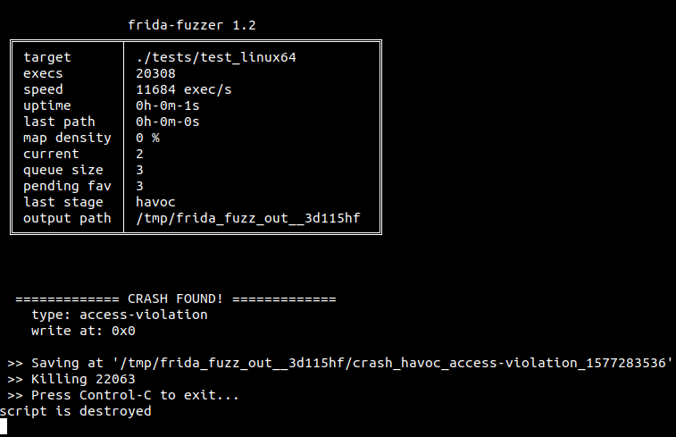
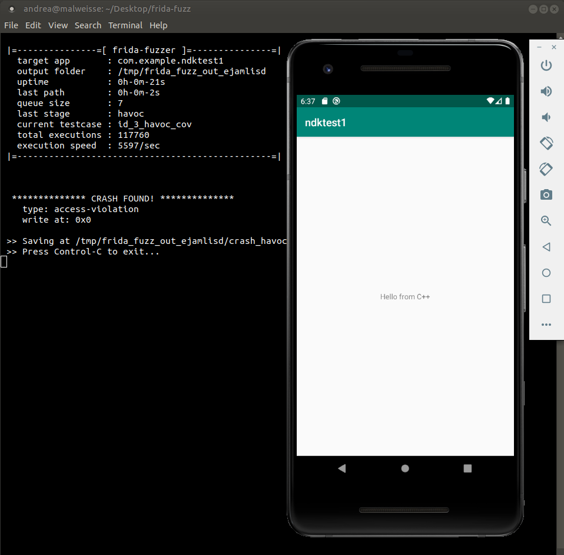

# Frida API Fuzzer

> v1.4 Copyright (C) 2020 Andrea Fioraldi <andreafioraldi@gmail.com>
> 
> Released under the Apache License v2.0

This experimental fuzzer is meant to be used for API in-memory fuzzing.

The design is highly inspired and based on AFL/AFL++.

ATM the mutator is quite simple, just the AFL's havoc and splice stages.

I tested only the examples under tests/, this is a WIP project but is known to works at least on GNU/Linux x86_64 and Android x86_64.

You need Frida >= 12.8.1 to run this (`pip3 install -U frida`) and frida-tools to compile the harness.

## Usage

The `fuzz` library has to be imported into a custom harness and then compiled with `frida-compile` to generate the agent that `frida-fuzzer` will inject into the target app.

The majority of the logic of the fuzzer is in the agent.

A harness has the following format:

```js
var fuzz = require("./fuzz");

var TARGET_MODULE = "test_linux64";
var TARGET_FUNCTION = DebugSymbol.fromName("target_func").address;;
var RET_TYPE = "void";
var ARGS_TYPES = ['pointer', 'int'];

var func_handle = new NativeFunction(TARGET_FUNCTION, RET_TYPE, ARGS_TYPES, { traps: 'all' });

fuzz.target_module = TARGET_MODULE;

var payload_mem = Memory.alloc(fuzz.config.MAX_FILE);

fuzz.fuzzer_test_one_input = function (/* Uint8Array */ payload) {

  Memory.writeByteArray(payload_mem, payload, payload.length);

  func_handle(payload_mem, payload.length);

}
```

`fuzz.fuzzer_test_one_input` is mandatory. If you don't specify `fuzz.target_module`, all the code executed will be instrumented.

You can also set `fuzz.manual_loop_start = true` to tell the fuzzer that you will call `fuzz.fuzzing_loop()` in a callback and so it must not call it for you (e.g. to start fuzzing when a button is clicked in the Android app).

The callback `fuzz.init_callback` can be set to execute code when the fuzzer is ready to begin. See `tests/test_java.js` for an example.

`fuzz.dictionary` is a classic fuzzer dictionary, an array in which you can add items (accepted types are Array, ArrayBuffer, Uint8Array, String) that are used as additional values in the mutator. See `tests/test_libxml2.js` for an example.

`frida-fuzzer` accepts the following arguments:

<table>
    <tr>
        <td>-i FOLDER</td>
        <td>Folder with initial seeds</td>
    </tr>
    <tr>
        <td>-o FOLDER</td>
        <td>Output folder with intermediate seeds and crashes</td>
    </tr>
    <tr>
        <td>-U</td>
        <td>Connect to USB</td>
    </tr>
    <tr>
        <td>-spawn</td>
        <td>Spawn and attach instead of simply attach</td>
    </tr>
    <tr>
        <td>-script SCRIPT</td>
        <td>Script filename (default is fuzzer-agent.js)</td>
    </tr>
</table>

If you don't specify the output folder, a temp folder is created under /tmp.
If you don't specify the folder with the initial seed, an uninformed seed `0000` is used as starting seed.

If you are fuzzing a local application, you may want to execute `system-config` before `frida-fuzzer` to tune the parameters of your system and speed-up the things.

Running `./frida-fuzzer -spawn ./tests/test_linux64` you will see something like the following status screen on your terminal:



You can also easily add a custom stage in `fuzz/fuzzer.js` and add it to the stages list in `fuzz/index.js`.

To customize the fuzzer, edit `fuzz/config.js`.
The variables that you may want to change are MAP_SIZE (If the code that you are fuzzing is small you can reduce it and gain a bit of speed), MAX_FILE (the maximum size of generated input) and QUEUE_CACHE_MAX_SIZE (increase the queue cache size for more speed, especially on Android).

## Example

Let's fuzz the native shared library in the example Android app in `tests`.

Make sure you have root on your virtual device:

```
host$ adb root
```

Download the Android x86_64 frida-server from the repo release page and copy it
on the device under /data/local/tmp (use adb push).

Start a shell and run the frida-server:

```
device# cd /data/local/tmp
device# ./frida-server
```

Now install the test app `tests/app-debug.apk` using the drag & drop into the emulator window.

Then, open the app.

Compile the agent script wiht frida-compile:

```
host$ frida-compile -x tests/test_ndk_x64.js -o fuzzer-agent.js
```

Open the app in the emulator.

Fuzz the `test_func` function of the `libnative-lib.so` library shipped with the test app
with the command:

```
host$ ./frida-fuzzer -U -o output_folder/ com.example.ndktest1
```

Interesting testcases and crashes are both saved into output_folder.

Enjoy.



## TODO

Hey OSS community, there are a lot of TODOs if someone wants to contribute.

+ ~~Java code fuzzing (waiting for additional exposed methods in frida-java-bridge, should be easy, almost done)~~
+ ~~splice stage (merge two testcase in queue and apply havoc on it)~~
+ ~~support dictionaries (and so modify also havoc)~~
+ ~~seed selection~~
+ inlined instrumentation for arm64
+ performance scoring (explore schedule of AFL)
+ structural mutator (mutate bytes based on a grammar written in JSON)
+ CompareCoverage (sub-instruction profiling to bypass fuzzing roadblocks)
+ rewrite frida-fuzzer in C with frida-core to be able to run all stuff on the mobile device

If you have doubt on one of this featues feel free to DM me on [Twitter](https://twitter.com/andreafioraldi).

For features proposals, there is the [Issues section](https://github.com/andreafioraldi/frida-fuzzer/issues).

